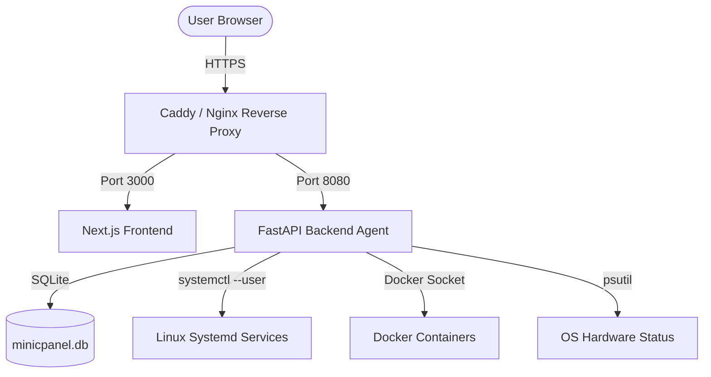
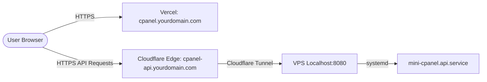

# mini.cpanel

A minimalist, lightweight, and self-hosted server orchestration dashboard designed to deploy and monitor personal web applications and background services.

[](https://nextjs.org)
[](https://fastapi.tiangolo.com)
[](https://www.typescriptlang.org)
[](https://www.python.org)
[](https://www.sqlite.org)
[](LICENSE)

<br />

👉 **[Live Demo](https://demo.cpanel.dilua.site/)**


<br />

<p align="center">
  
</p>

---

## Technical Stack

* **Frontend**: Next.js (React 19), Tailwind CSS, TypeScript, Monospace & Outfit typography.
* **Backend**: FastAPI (Python 3), SQLAlchemy ORM, SQLite database, and system-level telemetry.
* **Service Orchestration**:
  * **Linux**: Native Systemd service management (user-space or root).
  * **Windows**: NSSM (Non-Sucking Service Manager) for Windows Services.
  * **Universal**: Native Docker CLI integration via Docker Engine sockets.

---

## System Architecture



---

## Core Features

1. **System Telemetry & Telemetries**: Real-time tracking of hardware health (CPU, memory, disk usage, and uptime) with sparkline visualizers, and ingress traffic monitoring (requests per second, HTTP status codes, and bandwidth usage).
2. **Project Deployer & Auto-Setup Engine**: Automated deployment of projects directly from Git repositories using Docker, Systemd (Linux), or NSSM (Windows) with dynamic port allocation. Features an **Auto-Setup Engine** that automatically detects project stacks and configures environments for **Node.js, Bun, Python (virtualenv), PHP (Composer), Go, and Rust**.
3. **Deployment History & Build Logs**: Tracks git commit metadata (commit message, SHA, author, and timestamp) for every deployment run and records comprehensive build/compilation logs.
4. **Web-Based File Explorer**: Interactive file manager allowing users to browse, create, delete, and edit files (such as configuration `.env` files) directly in their web browser.
5. **Database Administrator**: A lightweight administration interface to inspect tables, review schemas, perform pagination on rows, and execute raw SQL queries securely for SQLite, PostgreSQL, and MySQL.
6. **Task Scheduler (Cron Jobs)**: An integrated task scheduler with an interactive cron expression generator and log monitors to capture output and execution history.
7. **Backup & Recovery System**: Folder and database compression tools with scheduled automated backups, supporting local storage and remote storage configurations.
8. **SSL/HTTPS Automation**: Automated Let's Encrypt SSL certificate issuance and renewal (via ACME/Certbot) for configured domains and subdomains pointing to the server.
9. **System Alerting**: Integration with Telegram and Discord webhooks to dispatch notifications when hardware thresholds are exceeded or if service status changes.
10. **Global Docker Manager**: Full visual dashboard to track all running/stopped Docker containers on the host, stream logs, monitor real-time resource utilization, view active networks/volumes, and prune dangling images.
11. **Ingress Proxy Router**: Map custom domain routes directly to internal ports or external host addresses, write proxy server configurations dynamically, trigger service hot-reloads, and request automatic Let's Encrypt SSL certificates.

---

## API Documentation

Complete developer reference for all FastAPI REST endpoints and WebSockets is available in the [docs/README.md](docs/README.md) file.


---

## Installation & Getting Started (Local Development)

### Prerequisites
* Python 3.10 or newer
* Node.js v18 or newer (with npm)
* Git
* (Optional) Docker Engine

### 1. Set Up the Backend Agent (`api`)
1. Navigate to the backend directory and create a Python Virtual Environment:
   ```bash
   cd api
   python -m venv .venv
   ```
2. Activate the virtual environment:
   * **Linux/macOS**: `source .venv/bin/activate`
   * **Windows**: `.venv\Scripts\activate`
3. Install the dependencies:
   ```bash
   pip install .
   ```
4. Start the development server using Uvicorn:
   ```bash
   uvicorn app.main:app --host 127.0.0.1 --port 8080 --reload
   ```

### 2. Set Up the Frontend Dashboard (`web`)
1. Navigate to the frontend directory:
   ```bash
   cd web
   ```
2. Install the Node.js packages:
   ```bash
   npm install
   ```
3. Run the Next.js development server:
   ```bash
   npm run dev
   ```
   Open [http://localhost:3000](http://localhost:3000) to access the dashboard.

---

## Production Deployment (Hybrid Setup) - *Recommended*

The project is designed using a secure **hybrid architecture**:
* **Frontend**: Hosted on **Vercel** for high availability, fast loading, and edge rendering.
* **Backend Agent**: Hosted on your **VPS** via **Systemd** to allow direct, low-level OS access (Docker, systemctl, file system).
* **Connection**: Securely bridged using a **Cloudflare Tunnel**, which encrypts traffic and removes the need to open any inbound firewall ports on your VPS.



### 1. Set Up the Backend Agent on VPS
First, log in to your VPS via SSH:
```bash
ssh yourusername@your_vps_ip
```

Then, configure your FastAPI backend to run as a persistent daemon.

1. Create a systemd service file at `/etc/systemd/system/mini-cpanel.api.service`:
   ```ini
   [Unit]
   Description=Mini cPanel FastAPI Backend Service
   After=network.target

   [Service]
   User=yourusername
   WorkingDirectory=/home/yourusername/mini-cpanel/api
   ExecStart=/home/yourusername/mini-cpanel/api/.venv/bin/uvicorn app.main:app --host 127.0.0.1 --port 8080
   Restart=always

   # Environment Variables
   Environment="CPANEL_SECRET_KEY=your-production-secret-key"
   # Allow only your Vercel frontend domain to access the API (CORS Protection)
   Environment="CPANEL_BACKEND_CORS_ORIGINS=https://cpanel.yourdomain.com"
   Environment="CPANEL_DATA_DIR=/home/yourusername/.minicpanel"
   Environment="CPANEL_APPS_DIR=/home/yourusername/apps"

   [Install]
   WantedBy=multi-user.target
   ```

2. Enable and start the backend service:
   ```bash
   sudo systemctl daemon-reload
   sudo systemctl enable mini-cpanel.api.service
   sudo systemctl start mini-cpanel.api.service
   ```

---

### 2. Set Up Cloudflare Tunnel (`cloudflared`) on VPS
Connect your backend port `8080` to your Cloudflare domain securely without opening any public incoming ports.

1. **Install cloudflared**:
   * **Option A: Download binary directly (Universal for Linux x86_64)**:
     ```bash
     sudo curl -L https://github.com/cloudflare/cloudflared/releases/latest/download/cloudflared-linux-amd64 -o /usr/local/bin/cloudflared
     sudo chmod +x /usr/local/bin/cloudflared
     ```
   * **Option B: Using Package Manager (Debian/Ubuntu)**:
     ```bash
     # Add Cloudflare gpg key
     sudo mkdir -p --mode=0755 /usr/share/keyrings
     curl -fsSL https://pkg.cloudflare.com/cloudflare-main.gpg | sudo tee /usr/share/keyrings/cloudflare-main.gpg >/dev/null

     # Add package repository
     echo 'deb [signed-by=/usr/share/keyrings/cloudflare-main.gpg] https://pkg.cloudflare.com/cloudflared/ buster main' | sudo tee /etc/apt/sources.list.d/cloudflared.list

     # Install cloudflared
     sudo apt-get update && sudo apt-get install cloudflared
     ```

2. **Login & Authenticate**:
   > [!IMPORTANT]
   > **Prerequisite**: Your custom domain (e.g., `yourdomain.com`) must already be added and active in your Cloudflare account at [https://dash.cloudflare.com/](https://dash.cloudflare.com/).

   ```bash
   cloudflared tunnel login
   ```
   *Note for Headless VPS (No GUI)*: This command will display an authorization link. Copy the URL from your VPS terminal, paste it into your local computer's web browser, log in to your Cloudflare account at [https://dash.cloudflare.com/](https://dash.cloudflare.com/), and select the domain you want to authorize. Once authorized, `cloudflared` on your VPS will automatically detect it and download the required credentials certificate (`cert.pem`).

3. **Create the Tunnel**:
   ```bash
   cloudflared tunnel create cpanel-tunnel
   ```
   This command creates the tunnel and outputs a UUID. It saves the credentials JSON file inside `~/.cloudflared/`.

4. **Configure `config.yml`**:
   Create a configuration file at `~/.cloudflared/config.yml`:
   ```yaml
   tunnel: <your-tunnel-uuid>
   credentials-file: /home/yourusername/.cloudflared/<your-tunnel-uuid>.json

   ingress:
     # Route incoming API traffic to local FastAPI agent
     - hostname: cpanel-api.yourdomain.com
       service: http://localhost:8080
     # Fallback rule returning 404
     - service: http_status:404
   ```

5. **Create the DNS Route (Automatic CNAME)**:
   Link your backend subdomain to the tunnel by running:
   ```bash
   cloudflared tunnel route dns cpanel-tunnel cpanel-api.yourdomain.com
   ```
   *Note*: This CLI command automatically creates a CNAME record in your DNS settings on [https://dash.cloudflare.com/](https://dash.cloudflare.com/), pointing `cpanel-api.yourdomain.com` to `<your-tunnel-uuid>.cfargotunnel.com`.
   > [!NOTE]
   > Ensure this record's **Proxy Status** is set to **Proxied (Orange Cloud)**. Cloudflare Tunnel requires proxying to be enabled to establish the secure connection to your VPS.

6. **Run cloudflared as a Systemd Service**:
   Create `/etc/systemd/system/cloudflared.service`:
   ```ini
   [Unit]
   Description=Cloudflare Tunnel Daemon
   After=network.target

   [Service]
   Type=simple
   User=yourusername
   WorkingDirectory=/home/yourusername/.cloudflared
   ExecStart=/usr/bin/cloudflared tunnel --config /home/yourusername/.cloudflared/config.yml run
   Restart=always
   RestartSec=10

   [Install]
   WantedBy=multi-user.target
   ```
   *(Verify the path to cloudflared by running `which cloudflared` on your system).*

   Enable and start the service:
   ```bash
   sudo systemctl daemon-reload
   sudo systemctl enable cloudflared.service
   sudo systemctl start cloudflared.service
   ```

---

### 3. Deploy Frontend on Vercel
1. Import your repository into **Vercel**.
2. Select the **Root Directory** as `web/`.
3. In **Environment Variables**, configure:
   * `NEXT_PUBLIC_API_URL`: `https://cpanel-api.yourdomain.com` (your public Cloudflare Tunnel URL. **Note**: The `https://` protocol prefix is required).
4. Click **Deploy**.
5. **Configure Custom Domain & DNS CNAME**:
   * In Vercel Project Settings -> **Domains**, add your custom frontend domain (e.g., `cpanel.yourdomain.com`). Vercel will display the target CNAME destination (typically `cname.vercel-dns.com`).
   * Go to your **Cloudflare Dashboard** ([https://dash.cloudflare.com/](https://dash.cloudflare.com/)), select your domain, navigate to **DNS -> Records**, and add the CNAME record manually:
     * **Type**: `CNAME`
     * **Name**: `cpanel` (or your chosen subdomain)
     * **Target**: `cname.vercel-dns.com`
     * **Proxy Status**: `DNS Only` (Grey Cloud) — *Important: Since Vercel handles SSL certificates automatically, this proxy status must be DNS Only (bypassing Cloudflare proxy) to prevent SSL handshake conflicts.*

---

### Option B: Docker Compose Deployment (Unified VPS)

If you prefer to run both the frontend and backend on the same VPS using Docker, you can use **Docker Compose**. This containerizes both services and makes the deployment portable and easy to manage.

#### 1. Create Dockerfiles

Create `api/Dockerfile` for the backend:
```dockerfile
FROM python:3.11-slim

RUN apt-get update && apt-get install -y git && rm -rf /var/lib/apt/lists/*

WORKDIR /app
COPY . .
RUN pip install --no-cache-dir .

EXPOSE 8080
CMD ["uvicorn", "app.main:app", "--host", "0.0.0.0", "--port", "8080"]
```

Create `web/Dockerfile` for the frontend:
```dockerfile
FROM node:18-alpine AS builder
WORKDIR /app
COPY package*.json ./
RUN npm install
COPY . .
ARG NEXT_PUBLIC_API_URL
ENV NEXT_PUBLIC_API_URL=$NEXT_PUBLIC_API_URL
RUN npm run build

FROM node:18-alpine AS runner
WORKDIR /app
COPY --from=builder /app/.next ./.next
COPY --from=builder /app/public ./public
COPY --from=builder /app/package*.json ./
RUN npm install --only=production

EXPOSE 3000
CMD ["npm", "start"]
```

#### 2. Create the `docker-compose.yml`
Create a `docker-compose.yml` in the root directory:
```yaml
version: '3.8'

services:
  backend:
    build: ./api
    ports:
      - "8080:8080"
    volumes:
      - /var/run/docker.sock:/var/run/docker.sock  # Mount host Docker socket to manage containers
      - minicpanel-data:/root/.minicpanel
    environment:
      - CPANEL_SECRET_KEY=your-production-secret-key
      - CPANEL_BACKEND_CORS_ORIGINS=https://cpanel.yourdomain.com
    restart: always

  frontend:
    build:
      context: ./web
      args:
        - NEXT_PUBLIC_API_URL=https://cpanel-api.yourdomain.com
    ports:
      - "3000:3000"
    depends_on:
      - backend
    restart: always

volumes:
  minicpanel-data:
```

#### 3. Run the Stack
Start the services in the background:
```bash
docker compose up -d --build
```
Your frontend will be accessible at `http://localhost:3000` and your backend at `http://localhost:8080`.

---

### Option C: Portable Binary

If you prefer to run Mini cPanel as a single zero-dependency executable on your VPS:

#### 1. Download & Run the Binary
Log into your Linux VPS and execute the following:

```bash
# Download the latest Linux x86_64 binary
wget https://github.com/jimbon25/mini-cpanel/releases/latest/download/mini-cpanel

# Grant execute permissions
chmod +x mini-cpanel

# Start the panel (optionally pass a custom port)
./mini-cpanel 8080
```

#### 2. Access in Browser
Open `http://YOUR_VPS_IP:8080` in your web browser. The **Web Installation Wizard** will automatically launch to help you register your admin username and password.


> [!NOTE]
> All database settings, user accounts, and project configs are stored in a folder named `cpanel-data/` created **automatically next to the executable**. Keep this folder to retain your configuration and projects.

> [!WARNING]
> For remote VPS deployments, if the page buffers or times out, make sure you open the selected port (e.g. `8080`) in your VPS provider's firewall dashboard.

---

## GitHub Auto-Deploy Webhook Setup

You can configure automatic redeployments whenever code is pushed to your Git repository:

1. **Get Webhook Details**: Under the project configuration card in the dashboard, expand the **Git Webhook** section to reveal your project's unique **Payload URL** (e.g., `http://your-domain/api/v1/projects/webhook/<project-id>`) and **Secret Key**.
2. **Configure GitHub**:
   - Open your project repository on GitHub.
   - Navigate to **Settings** -> **Webhooks** -> **Add webhook**.
   - Paste the **Payload URL** from your dashboard.
   - Change the **Content type** to `application/json`.
   - Paste the **Secret Key** into the **Secret** field.
   - Choose **Just the push event** and click **Add webhook**.
3. **Verify**: Run a `git push` to your repository. Mini cPanel will verify the cryptographic signature, trigger a redeployment in the background, fetch the latest commit details, and log the build process.

---

## Testing

* **Backend Tests (Pytest)**:
  ```bash
  cd api
  .venv/bin/pytest
  ```
* **Frontend Tests (Jest)**:
  ```bash
  cd web
  npm test
  ```

---

## Support

If you find this project useful, feel free to buy me a cup of iced milk coffee:

[](https://saweria.co/dimasla)

---

## Support & Bug Reports

If you encounter any bugs, security vulnerabilities, or have general feedback, please feel free to open a GitHub Issue or contact me directly at [luisdimas838@gmail.com](mailto:luisdimas838@gmail.com).


